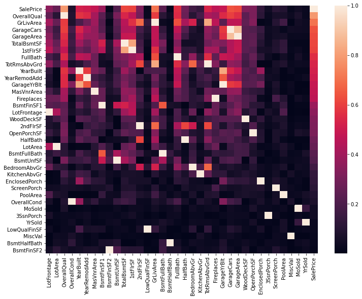

# Analysing the Ames Housing Dataset
In this project I examined the Ames Housing Dataset from Kaggle's [Advance Regression Techniques Competition](https://www.kaggle.com/c/house-prices-advanced-regression-techniques) and explored various data science and machine learning techniques to analyse the dataset and make house price predictions. The following sections highlight key findings from this analysis and compare the predictions from the resulting machine learning models.

## Data Exploration
The heat map below shows the strenght of correlation of each feature with the target - `SalePrice`. The features with the strongest correlation were indicators of quality (`OverallQual`), area (`GrLivArea`, `1stFlrSF`), number of rooms (`TotRmsAbvGrd`), garage size (`GarageCars`, `GarageArea`) and the age of the property (`YearBuilt`, `YearRemodAdd`)

## Missing Values - Imputing Lot Frontage
One of the more challenging tasks was imputing missing values for the `LotFrontage` feature (17.7% of training examples were missing this value). Values for this variable ranged between 21 and 313, with a mean of 70.04. Estimating `LotFrontage` using the mean resulted in a mean absolute error of 15.41. I instead opted to impute missing values using a random forest regressor, using the following features: `Neighborhood`, `LotArea`, `BldgType`, `MSZoning` (the general zoning classification e.g. agriculture, commercial, residential high density), `GarageCars`. This reduced the MAE to 8.52.

## Feature Engineering - K-means Clustering
I used the K-means clustering algorithm to split the data into 3 clusters based on `YearBuilt` and `YearRemodAdded`. The plot below illustrates this and shows that for newer properties, the year the house was built has a greater impact on Sale Price. Looking at the older properties in the dataset, the trend shows a slight decrease in value over time (though the uncertainty here is greater) with a possible explanation being premium prices for antique homes.

[YearBuilt vs YrCluster]()

## Models & Predictions
I compared 3 models: XGBoost, Random Forest Regression and a Neural Network. The evaluation metric used for the Kaggle competition was RMSLE (root mean square logarithmic error). As a baseline value, the RMSLE obtained by the Kaggle benchmark submission from a linear regression on year and month of sale, lot square footage, and number of bedrooms was 0.40613

The models used in this project achieved the following scores:
- XGBoost: 0.14604
- Random Forest: 0.15037
- Neural Network: 0.19792

### XGBoost
After iterating over a range of hyperparameter values, I found the following to produce the most accurate results on the test dataset:
- Learning rate: 0.1
- No. of estimators: 100

[Learning Curve - XGBoost]()

The learning curve shows the model to be overfitting, and the negative gradient of the validation loss-curve shows that there would be potential success in increasing the number of training examples to combat this. 

### Random Forest
The random forest model, using 300 estimators, performed slightly worse than the XGBoost model. The learning curve below shows a similar trend.

[Learning Curve - Random Forest Regressor]()

### Neural Network
The neural network scored lowest of the 3 models. It was comprised of 3 dense layers (with 512, 256, 256 neurons respectively) with each layer using ReLU activation function and utilised L1 regularization on the first two layers. The next step will be to perform further hyperparameter tuning and potentially feature engineering to improve the model's performance.

[Learning Curve - Neural Network]()

## Further Work
As an extension of the project, I plan to delve into the XGBoost and Neural Network models and perform a more in-depth optimization process, before comparing their performance.
